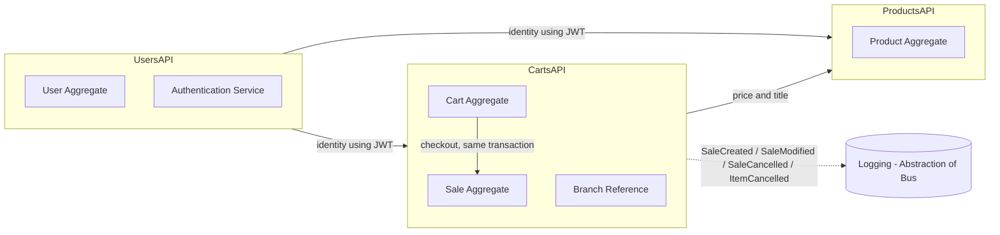
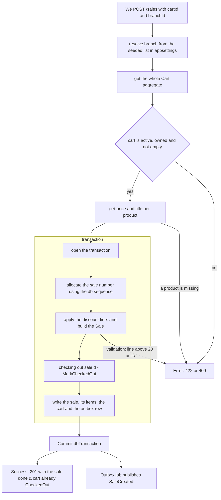
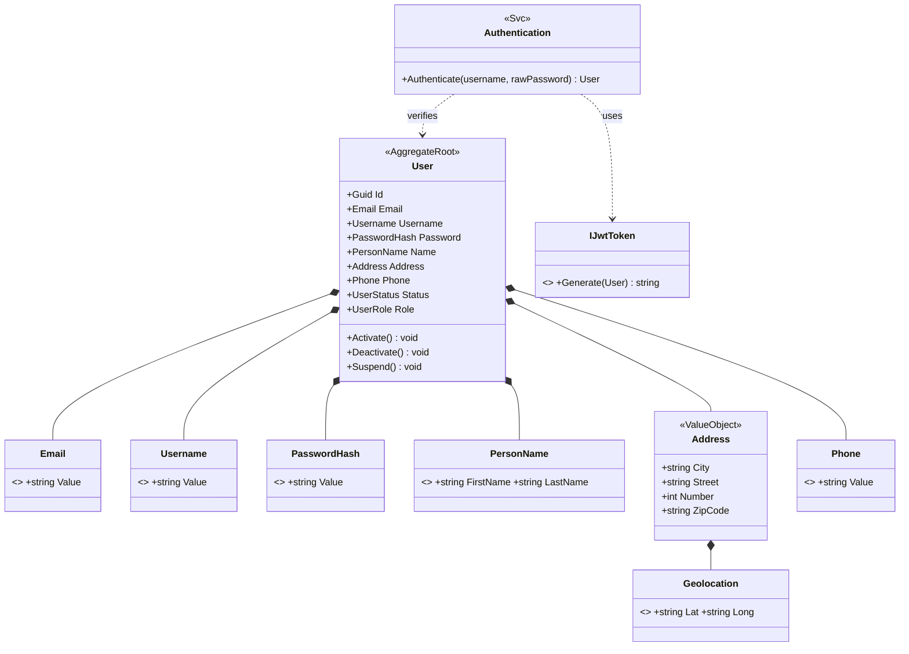
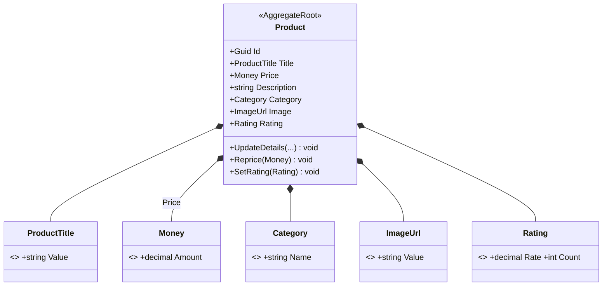
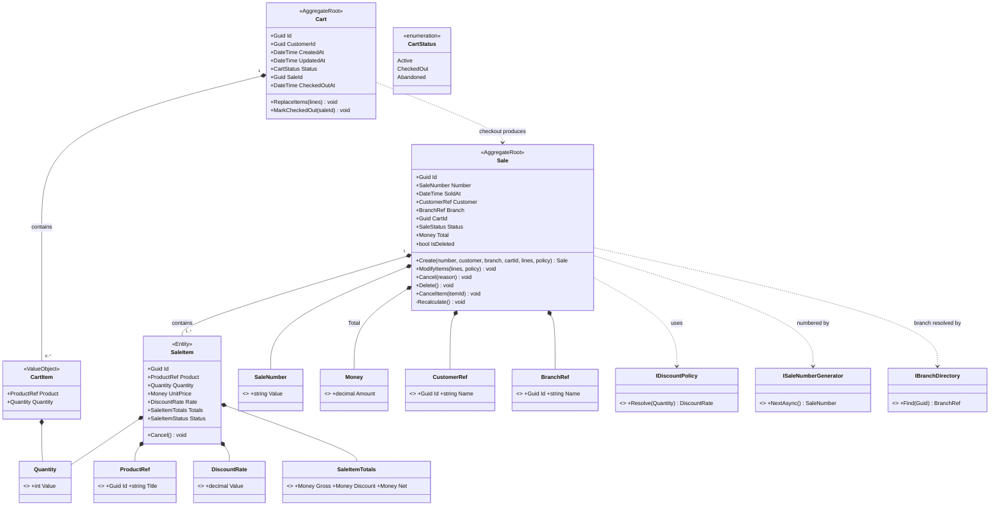
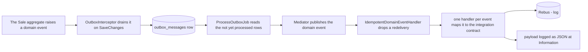
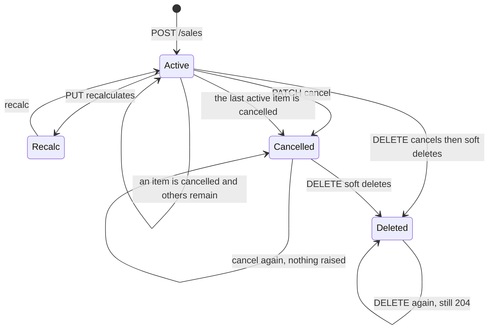

# Diagrams

## Context Map

## Checkout Flow

## Identity and Access Management (IAM) - Domain Diagram

## Product Catalog Context - Domain Diagram

## Sales Context - Domain Diagram

## Sale Event Publishing

## Sale Lifecycle

