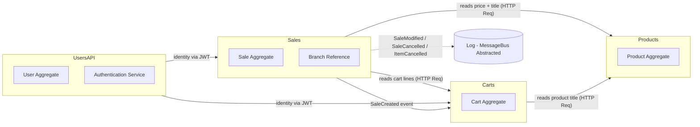
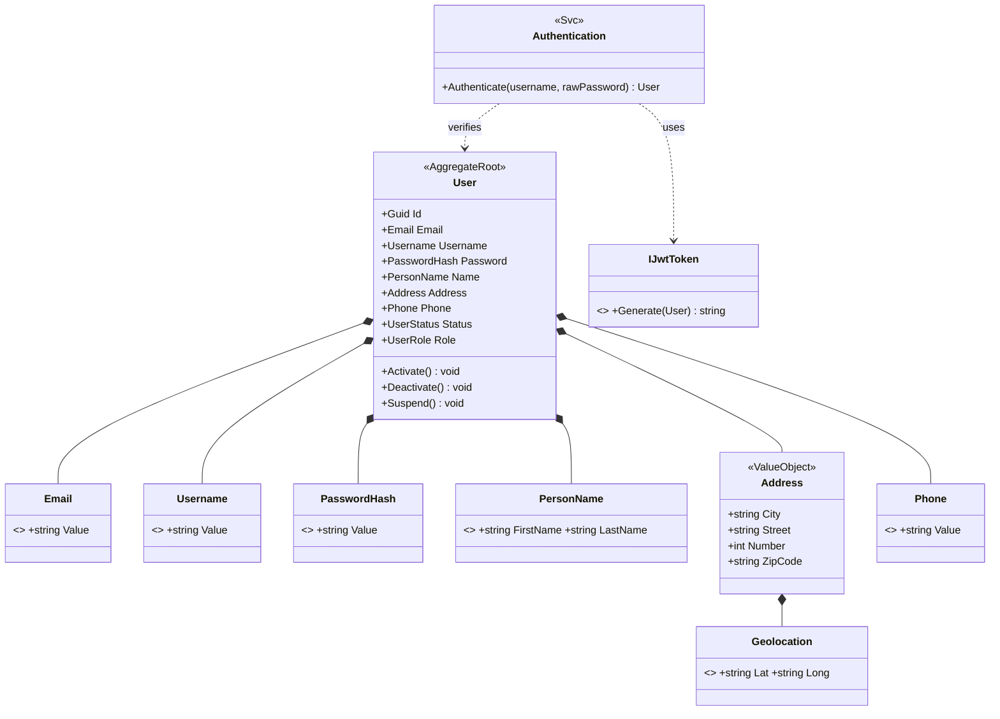
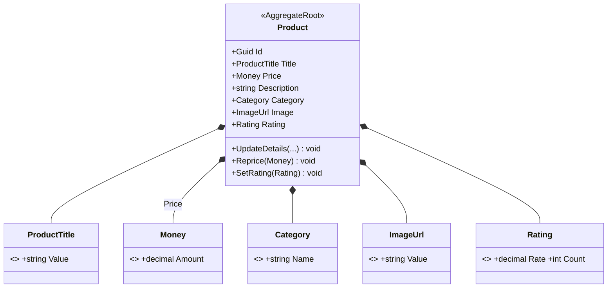
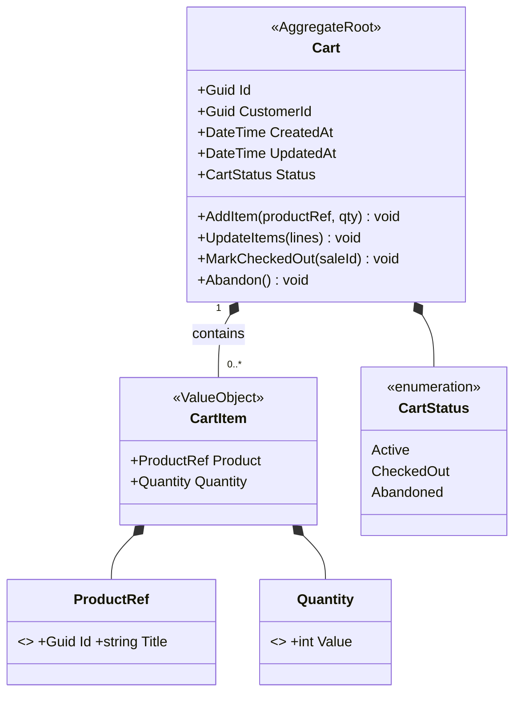
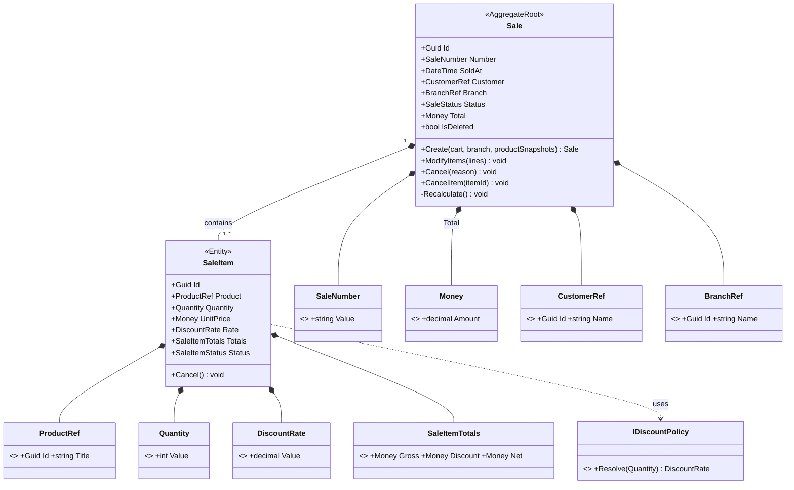

# DDD Plan — Diagrams

## Context Map

## Identity and Access Management (IAM) — Domain Diagram

## Product Catalog Context — Domain Diagram

## Cart Context — Domain Diagram

## Sales Context — Domain Diagram

